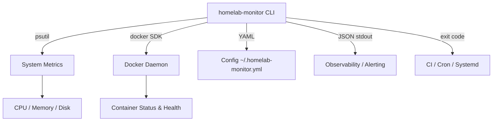

# homelab-monitor

> Self-healing homelab infrastructure — a Python CLI that watches Docker containers, disk usage, CPU, memory, and top processes. Built to keep the stack healthy so the mesh backend can stay online.

This project is part of a portfolio narrative: **Self-healing homelab infrastructure with intelligent mesh-network backend**. It pairs with [`faulty-link-backend`](https://github.com/peteedoo/faulty-link-backend), a Go HTTP bridge for Meshtastic mesh networks.

## Architecture

```
┌─────────────────────────────────────────────────────────────────────────────┐
│                              Homelab Host                                    │
│  ┌──────────────────────┐    ┌──────────────────────────────────────────┐  │
│  │  homelab-monitor     │    │  Docker Daemon                           │  │
│  │  (Python CLI)        │◄───┤  • faulty-link-backend                   │  │
│  │                      │    │  • databases, caches, reverse proxies    │  │
│  │  • CPU / mem / disk  │    └──────────────────────────────────────────┘  │
│  │  • Top processes     │                                                  │
│  │  • Docker health     │    ┌──────────────────────────────────────────┐  │
│  │  • Alert thresholds  │    │  Systemd / cron / CI                     │  │
│  │                      │◄───┤  • Runs monitor on interval              │  │
│  └──────────────────────┘    │  • Alerts trigger notifications          │  │
│           │                  └──────────────────────────────────────────┘  │
│           │ JSON / exit code                                                 │
│           ▼                                                                  │
│  ┌──────────────────────────────────────────────────────────────────────┐   │
│  │  Observability stack (future: Prometheus, Grafana, PagerDuty)        │   │
│  └──────────────────────────────────────────────────────────────────────┘   │
└─────────────────────────────────────────────────────────────────────────────┘
```

### Component Diagram (Mermaid)



## Features

- [x] **System metrics** — CPU, memory, and per-mount disk usage via `psutil`
- [x] **Docker health** — container status and health checks using the Docker SDK
- [x] **Top processes** — configurable number of top CPU or memory consumers
- [x] **Pretty tables** — rich-formatted terminal output using `rich`
- [x] **JSON output** — `--json` flag for programmatic consumption and piping
- [x] **Alert thresholds** — configurable via YAML; non-zero exit code on breach
- [x] **CI/CD** — GitHub Actions runs `pytest` on Python 3.11 and 3.12
- [ ] **Prometheus exporter** — `/metrics` endpoint for scraping
- [ ] **Systemd timer** — built-in service unit for periodic health checks
- [ ] **Slack/Discord webhook alerts** — notify on threshold breach
- [ ] **Container auto-restart** — integrate with Docker API to restart unhealthy containers

## Quick Start

```bash
# 1. Clone and enter the repo
git clone https://github.com/peteedoo/homelab-monitor.git
cd homelab-monitor

# 2. Create a virtual environment
python -m venv .venv
source .venv/bin/activate

# 3. Install dependencies
pip install -r requirements.txt

# 4. Run the CLI
python -m homelab_monitor.cli
python -m homelab_monitor.cli --json --top 10
python -m homelab_monitor.cli --sort-by memory --top 5
```

## Setup / Install

### From source (editable)

```bash
cd ~/homelab-monitor
python -m venv .venv
source .venv/bin/activate
pip install -e ".[dev]"
```

### Configuration

Create `~/.homelab-monitor.yml` (or pass `--config /path/to/config.yml`):

```yaml
thresholds:
  cpu: 80.0
  memory: 90.0
  disk: 90.0
```

If any metric exceeds its threshold, the CLI exits with code `1` and prints an **Alerts** table.

## Usage Examples

### Interactive health check

```bash
$ python -m homelab_monitor.cli --top 3
```

**Screenshot description:** A terminal window showing four rich-formatted tables: "System Health" (CPU 12.5%, Memory 45.0%), "Disk Usage by Mount" (/dev/sda1 at 50%), "Top Processes" (python at 10% CPU), and "Docker Containers" (nginx:latest running and healthy).

### JSON output for scripting

```bash
$ python -m homelab_monitor.cli --json | jq '.alerts'
[]

$ python -m homelab_monitor.cli --json --config stress-test.yml | jq '.alerts'
[
  {
    "metric": "cpu",
    "value": 92.3,
    "threshold": 80.0
  }
]
```

**Screenshot description:** A terminal split pane. Left side runs the monitor CLI with `--json` and pipes through `jq` to highlight the empty alerts array. Right side shows the same command under synthetic load, with `jq` colorizing the breached CPU alert in red.

### Cron integration

```bash
# Add to crontab to run every 5 minutes
*/5 * * * * cd /opt/homelab-monitor && .venv/bin/python -m homelab_monitor.cli --json >> /var/log/homelab.jsonl 2>/dev/null || echo "ALERT" | logger
```

## Testing

```bash
# Run the full test suite
pytest -q

# Run with coverage
pytest --cov=src/homelab_monitor --cov-report=term-missing

# Run a specific module
pytest tests/test_monitor.py -v
```

The test suite covers:
- CLI argument parsing and exit codes (`test_cli.py`)
- YAML config loading and threshold extraction (`test_config.py`)
- Table formatting and human-readable byte conversion (`test_format.py`)
- Core monitoring logic with mocked `psutil` and Docker (`test_monitor.py`)

## Project Structure

```
.
├── .github/workflows/test.yml   # CI: pytest on push
├── src/
│   └── homelab_monitor/
│       ├── __init__.py
│       ├── cli.py               # argparse entrypoint
│       ├── config.py            # YAML config loader
│       ├── format.py            # pretty-printed table output
│       └── monitor.py           # core health logic
├── tests/
│   ├── __init__.py
│   ├── test_cli.py              # CLI tests
│   ├── test_config.py           # config loader tests
│   ├── test_format.py           # formatting tests
│   └── test_monitor.py          # monitor logic tests
├── pyproject.toml
├── requirements.txt
└── README.md
```

## Stack

- Python 3.11+
- `argparse`
- `psutil`
- `docker` (SDK)
- `rich`
- `pyyaml`
- `pytest`

## Roadmap

| Status | Item |
|--------|------|
| ✅ | Pretty-printed table output |
| ✅ | Docker container status integration |
| ✅ | Per-mount disk breakdown |
| ✅ | Alert thresholds / exit codes |
| 🔄 | Prometheus `/metrics` exporter |
| 🔄 | Systemd service + timer files |
| 📋 | Slack/Discord webhook alerts |
| 📋 | Container auto-restart on unhealthy state |
| 📋 | Historical trend logging (SQLite) |

---

*Part of the [Faulty Link portfolio](https://github.com/peteedoo) — self-healing infrastructure for off-grid mesh networks.*
